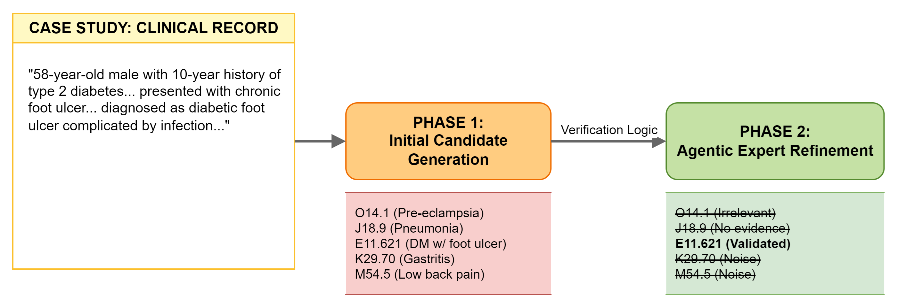
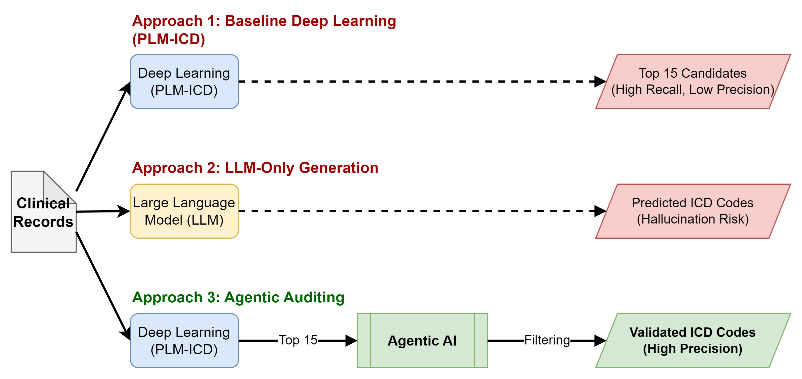
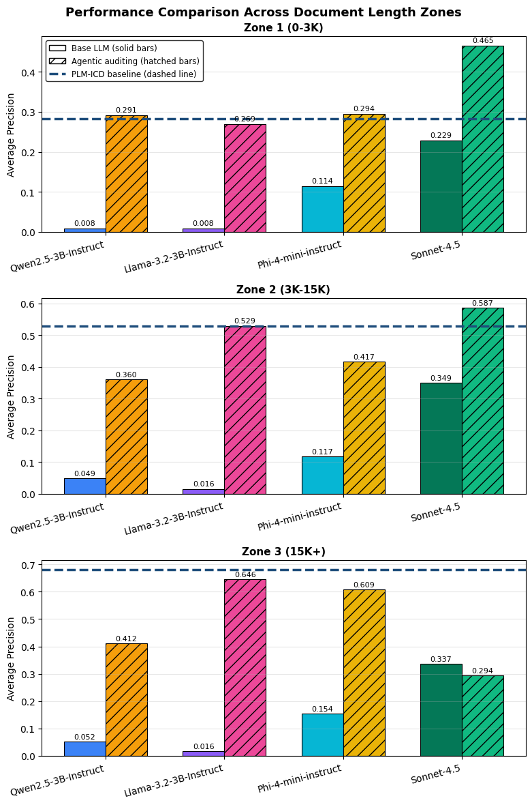

# ⚕️INTEGRATING AGENTIC ARTIFICIAL INTELLIGENCE TO AUTOMATE ICD-10 MEDICAL CODING

This article is openly available in *Informatics* (MDPI, 2026) and summarizes the workflow implemented in this repository.

```bibtex
@article{Akkhawatthanakun2026,
  author  = {Kitti Akkhawatthanakun and Lalita Narupiyakul and Konlakorn Wongpatikaseree and Narit Hnoohom and Chakkrit Termritthikun and Paisarn Muneesawang},
  title   = {Integrating Agentic Artificial Intelligence to Automate International Classification of Diseases, Tenth Revision, Medical Coding},
  journal = {Informatics},
  year    = {2026},
  volume  = {13},
  number  = {3},
  pages   = {39},
  doi     = {10.3390/informatics13030039},
  publisher = {MDPI}
}
```

**Introduction**

Automating ICD-10 coding is challenging because professional coders interpret long-form discharge summaries before auditors sign off on the submitted claims. The Informatics article reproduced here mirrors that two-stage workflow and compares three automation patterns: (i) PLM-ICD as a fixed-length deep learning baseline that always recommends 15 codes, (ii) LLM-only generation that attempts to replace coders outright, and (iii) a hybrid agentic pipeline in which PLM-ICD drafts candidates and an LLM reviewer accepts or rejects each suggestion.



All three patterns were benchmarked on 19,801 MIMIC-IV discharge summaries. Precision served as the primary metric because clinical teams can still add missing diagnoses, whereas false positives immediately degrade coder productivity. Four LLM checkpoints were evaluated—Qwen2.5-3B-Instruct, Llama-3.2-3B-Instruct, Phi-4-mini-instruct, and Sonnet-4.5—to study behavior from compact to large-scale models. PLM-ICD alone delivered 55.8% precision at 15 outputs, LLM-only generation lagged between 1.5–34.6%, and the agentic audit returned 2–8 high-confidence codes by pruning unsupported items. Notably, Llama-3.2-3B-Instruct improved from 1.5% precision as a generator to 55.1% as a verifier while trimming false positives by 73%.

The study shows that positioning LLMs as quality controllers rather than autonomous generators delivers the most reliable assistance to ICD-10 coders, while formal recall/F1 reporting remains future work for fully automated deployments. The sections below retain the practical setup so you can recreate each stage of the evaluated pipeline.

**Key Findings from the Informatics Article**

- Three automation paradigms—PLM-ICD, LLM-only generation, and the PLM-ICD + agentic verifier—were compared head-to-head under the same metrics, yielding an evidence-backed implementation roadmap.
- Results are stratified by discharge-summary length to highlight when traditional deep learning, pure LLMs, or the hybrid audit should be deployed inside hospital workflows.
- Agentic auditing achieved the best precision/effort trade-off: PLM-ICD maximized recall by surfacing 15 candidates, and compact LLMs discarded weak evidence to return concise, clinically grounded code lists.
- Precision-first reporting aligns with real-world coding teams, and the release includes open-source instructions plus prompts so others can extend the experiments toward recall/F1 analyses.


The grouped bar chart below is generated directly from our experimental logs (see `4.Analysis/analysis.ipynb`): after running the full pipeline, we aggregated each model's precision by discharge-summary length and plotted the audited vs. base LLM performance you see here.




**Related Research**

<table style="margin: auto; border-collapse: collapse;">
  <tr>
    <th style="text-align: center; vertical-align: middle;">Model</th>
    <th style="text-align: center; vertical-align: middle;">Paper</th>
    <th style="text-align: center; vertical-align: middle;">Original Code</th>
  </tr>
  <tr>
    <td style="text-align: center; vertical-align: middle;">PLM-ICD</td>
    <td style="text-align: center; vertical-align: middle;"><a href="https://doi.org/10.18653/v1/2020.bionlp-1.35">Huang et al., "PLM-ICD: Automatic ICD Coding with Pretrained Language Models"</a></td>
    <td style="text-align: center; vertical-align: middle;">Available to credentialed researchers per the original publication</td>
  </tr>
</table>


**Setup and Usage**

1. Install the environment and dependencies

Make sure you have Python 3.10 installed, then install the required packages:

```bibtex
python -m venv agentic-icd-coding
cd ./agentic-icd-coding
source ./bin/activate
```

Then, install the required packages and set up the project:

```bibtex
git clone https://github.com/sg31147/Agentic-Combine-ML
cd Agentic-Combine-ML
pip install -e .
```


2. Download the MIMIC-IV dataset from PhysioNet. You will need to request access to the MIMIC-IV data, which requires following the credentialing process on PhysioNet. Note that it typically takes 2–3 days to receive approval. They will review your intended use to ensure it is not for commercial purposes or for direct use in large language models (LLMs), as both are prohibited. After receiving approval, you can proceed with downloading the dataset.

3. [Clinical notes](https://physionet.org/content/mimic-iv-note/2.2/) (MIMIC-IV Note)

    	Place the file at: ./1.ML/dataset/mimiciv/note/*

4. [Reference tables](https://physionet.org/content/mimiciv/2.2/) (MIMIC-IV hosp files):

    - d_icd_diagnoses.csv.gz (855.8 KB)
    - d_icd_procedures.csv.gz (575.4 KB)
    - diagnoses_icd.csv.gz (32.0 MB)
    - procedures_icd.csv.gz (7.4 MB)

			Place them at: ./1.ML/dataset/mimiciv/hosp/*
  

# Agentic Combine ML

This project walks through an end-to-end workflow for building a clinical coding model (PLM-ICD), enriching it with large-language-model (LLM) reasoning, and analyzing the final outputs. The notebooks/scripts listed below are ordered so you can reproduce the same pipeline locally.

## 1. Build the PLM-ICD model (`1.ML`)
Run the notebooks in `1.ML/notebooks` in the order shown:

1. `1.ethical_data_preparation/mimiciv.ipynb` – prepares the MIMIC-IV dataset with the required ethical constraints.
2. `2.data_partition/mimiciv.ipynb` – splits the curated data into train/validation/test subsets.
3. `3.model_learning/train.ipynb` – trains the PLM-ICD model.
4. `3.model_learning/validate.ipynb` – validates the trained weights.

The trained checkpoints are written to `1.ML/experiments/`.

## 2. Prepare the test dataset (`1.ML/app`)
Use `1.ML/app/test_dataset.ipynb` to extract only the test portion that will be shared downstream.


    Option A: Run the Notebooks
  
      Run notebooks steps 1–5 for data preprocessing, model training, and retrieval.
    
    Option B: Use Pre-Built Output
  
      Skip the above steps by downloading the prepared output from my public site.
  
      Place the files in:
      - ./file/*  [downloading](https://drive.google.com/file/d/1KihtLzPtCVNY-XcEmtLUL0i-uYacG5HR/view?usp=sharing)
      - ./experiment/*  [downloading](https://drive.google.com/file/d/1_551qOn7oPwLAvY3CcLWhxQCdmu0KxA0/view?usp=sharing)

## 3. Generate ML predictions (`1.ML/app`)
Open `1.ML/app/ml.ipynb` to run inference with the PLM-ICD model on the prepared test set. The notebook saves the predictions to `ml.csv`.

## 4. Run the Large Language Models (`2.LM`)
- `2.LM/OpensourceModel.ipynb`: executes the open-source LLM workflow.
- `2.LM/claude/Claude.sh`: triggers the commercial Claude-based workflow. The script already includes the required prompts/limitations, but monitor its usage closely because costs scale with the number of predictions.

## 5. Combine models with agents (`3.Agent_Combine_ML`)
- `3.Agent_Combine_ML/ag_OpensourceModel.ipynb`: agentic orchestration for the open-source LLM output.
- `3.Agent_Combine_ML/claude/ag_Claude.sh`: agentic orchestration for the Claude workflow (again, keep an eye on usage-based costs).


## 6. Analyze the results (`4.Analysis`)
Use `4.Analysis/analysis.ipynb` to inspect the combined outputs, compare models, and document findings.



